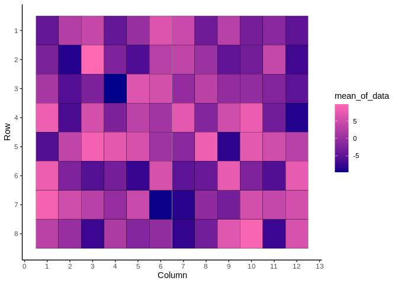
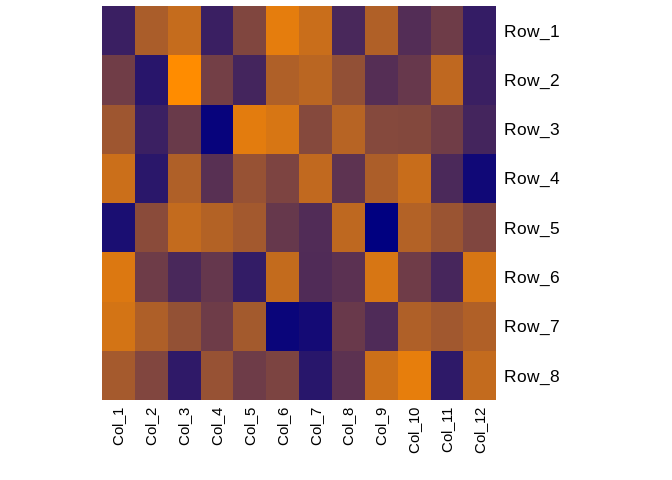

README
================
LGD
20/05/2023

-   [Demonstration data](#demonstration-data)
-   [emGeezen](#emgeezen)
-   [enGlimpse](#englimpse)

enGlimpse is a package of tools for **emgeezing** or **englimpsing** the
output of plate based biology experiments. The two main functions are
**emGeezen** and **enGlimpse** which both visualise experiment results
in a plate format. The functions have different flavours, and
**emGeezen** is recommended.

``` r
#install devtools if needed
if(!require("devtools")) install.packages("devtools")
```

    ## Loading required package: devtools

    ## Loading required package: usethis

``` r
#load devtools
library(devtools)

#install lifeTimes from github
install_github("somaSystems/enGlimpse")
```

    ## Skipping install of 'enGlimpse' from a github remote, the SHA1 (a4ca3ecc) has not changed since last install.
    ##   Use `force = TRUE` to force installation

## Demonstration data

``` r
#demonstration data in the format of a 96 well plate

set.seed(1)
df_to_glimpse <- data.frame(
  Row = rep(c(1:8), times = 12), #Rows as numbers
  Column = rep(c(1:12), each = 8), #Columns as numbers 
  exp_value = runif(96,-10,10)) #Measured variables
```

## emGeezen

-   emGeeze (verb form of the noun “Geez”), which is
    Australian/NewZealand slang for “squiz”,“gander” or a quick look at
    something. The verb from comes from the “em” prefix, as in the
    phrase “a noble spirit embiggins the smallest person”.

``` r
library(enGlimpse)
emGeezen(df_to_glimpse, variable_to_squiz ="exp_value" )
```

    ## rownames is called... Row

<!-- -->

## enGlimpse

-   enGlimpse (verb form of the noun “glimpse”) is a package of tools
    for **englimpsing** the output of plate based biology experiments.  
-   the main function is enGlimpse for visualising summary statistics of
    your plate based experiment

``` r
enGlimpse(df_to_glimpse, picked_variable = "exp_value")
```

<!-- -->
