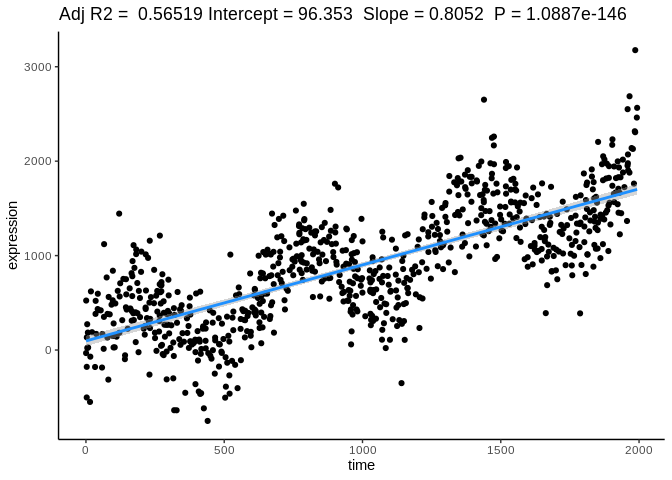

README
================
LGD
20/05/2023

-   [Installation](#installation)
-   [glancer demonstration data](#glancer-demonstration-data)
-   [glancer](#glancer)
-   [eggresR demonstration data](#eggresr-demonstration-data)
-   [egressR](#egressr)
-   [chillstall](#chillstall)

enGlimpse is a package of tools for working with the output of biology
and microscopy experiments in R. It includes functions for common
visualisation and normalisation things that you need to do.

The visualisation functions are **limpsing** or having a **squiz** at
the output of plate based biology experiments. The normalisation
function is for **eggresR**ing to remove linear trends.

## Installation

``` r
#install devtools if needed
if(!require("devtools")) install.packages("devtools")
#load devtools
library(devtools)

#install lifeTimes from github
install_github("somaSystems/enGlimpse")
```

## glancer demonstration data

``` r
#demonstration data in the format of a 96 well plate

set.seed(1)
df_to_glimpse <- data.frame(
  Row = rep(c(1:8), times = 12), #Rows as numbers
  Column = rep(c(1:12), each = 8), #Columns as numbers 
  exp_value = runif(96,-10,10)) #Measured variables
```

## glancer

For having a glance at the data

``` r
library(enGlimpse)
glancer(df_to_glimpse, variable_to_squiz ="exp_value" )
```

<!-- -->

## eggresR demonstration data

``` r
set.seed(42)  # Set seed for reproducibility

n <- 800  # Number of data points
x <- runif(n, 0, 2000)  # Generate random x values between 0 and 1000

# Generate y values with a linear correlation and a sine wave pattern
amplitude <- 400  # Amplitude of the sine wave
y <- .9 * x + rnorm(n, 0, 300) + amplitude * sin(0.01 * x)

cyclic_riser_df <-data.frame(time = x, expression = y) 
```

## egressR

``` r
corrected_cyclic_riser_df <- egressR(
                      data_frame_to_build_model = cyclic_riser_df,
                      response_var = "expression",
                      predictor_variable = "time")
```

    ## Loading required package: ggplot2

    ## `geom_smooth()` using formula = 'y ~ x'

<!-- -->

**view original and normalised data**

``` r
#Normalised data
ggplot(corrected_cyclic_riser_df, aes( x = time, y = normalisedexpressionfrom_time))+
  geom_point()+
  theme_classic()+
  ggtitle("detrended cyclic data")
```

<!-- -->

## chillstall

For loading and chill installing packages that may or may not be
installed.

If you have lots of time on your hands “chillinstall” is one way to use
this function. Otherwise “chinstall” and “chillstall”, are both valid
and creative ways to abbreviate “chill install”, and you can use
whichever you prefer. Each combines the words “chill” and “install” into
a single word, making it even shorter and potentially easier to
pronounce. Ultimately, the choice between “chinstall” and “chillstall”
comes down to personal preference and which option resonates better with
you.

``` r
chinstall("ggplot2")

chillstall("ggplot2")

chillinstall("ggplot2")
```
