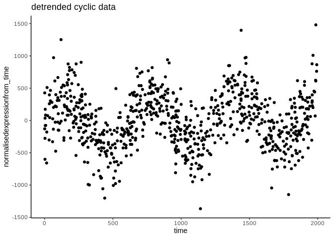

README
================
LGD
20/05/2023

-   [Installation](#installation)
-   [glancer](#glancer)
-   [egressR](#egressr)
-   [chillstall](#chillstall)
-   [fastloadr](#fastloadr)


<br> <br> **glimpseR** is a package of tools for working with the output
of biology and microscopy experiments in R. It includes functions for
common visualisation and normalisation things that you need to do.

The visualisation functions are **limpsing** or having a **squiz** at
the output of plate based biology experiments. The normalisation
function is for **eggresR**ing to remove linear trends.

## Installation

``` r
#install devtools if needed
if(!require("devtools")) install.packages("devtools")
#load devtools
library(devtools)

#install lifeTimes from github
install_github("somaSystems/enGlimpse")
```

## glancer

<br> **glancer demonstration data**

``` r
#demonstration data in the format of a 96 well plate

set.seed(1)
df_to_glimpse <- data.frame(
  Row = rep(c(1:8), times = 12), #Rows as numbers
  Column = rep(c(1:12), each = 8), #Columns as numbers 
  exp_value = runif(96,-10,10)) #Measured variables
```

For having a glance at the data <br> **run glancer**

``` r
library(enGlimpse)
glancer(df_to_glimpse, variable_to_squiz ="exp_value" )
```

<!-- -->

## egressR

<br> **eggresR demonstration data**

``` r
set.seed(42)  # Set seed for reproducibility

n <- 800  # Number of data points
x <- runif(n, 0, 2000)  # Generate random x values between 0 and 1000

# Generate y values with a linear correlation and a sine wave pattern
amplitude <- 400  # Amplitude of the sine wave
y <- .9 * x + rnorm(n, 0, 300) + amplitude * sin(0.01 * x)

cyclic_riser_df <-data.frame(time = x, expression = y) 
```

<br> **run egressR**

``` r
corrected_cyclic_riser_df <- egressR(
                      data_frame_to_build_model = cyclic_riser_df,
                      response_var = "expression",
                      predictor_variable = "time")
```

    ## Loading required package: ggplot2

    ## `geom_smooth()` using formula = 'y ~ x'

<!-- -->

**view original and normalised data**

``` r
#Normalised data
ggplot(corrected_cyclic_riser_df, aes( x = time, y = normalisedexpressionfrom_time))+
  geom_point()+
  theme_classic()+
  ggtitle("detrended cyclic data")
```

<!-- -->

## chillstall

For loading and chill installing packages that may or may not be
installed.

If you have lots of time on your hands “chillinstall” is one way to use
this function. Otherwise “chinstall” and “chillstall”, are both valid
and creative ways to abbreviate “chill install”, and you can use
whichever you prefer. Each combines the words “chill” and “install” into
a single word, making it even shorter and potentially easier to
pronounce. Ultimately, the choice between “chinstall” and “chillstall”
comes down to personal preference and which option resonates better with
you. <br> **run chillstall**

``` r
chinstall("ggplot2")

chillstall("ggplot2")

chillinstall("ggplot2")
```

## fastloadr

<br> RDS files load fast, but csv files load slow. This function is for
loading an \*.RDS file instead of \*.csv. If you don’t have an RDS
**fastrloadr** makes one for faster loading next time. <br> **fastloadr
demonstration data**

``` r
# Create demonstration csv
df <- data.frame(phrase = c("I have an urge for swiftness", "I have a desire for rapidity", 
                            "I have a hunger for haste", "I have a yearning for velocity", 
                            "I have a craving for quickness"))

if (!dir.exists("./README_files/data/")) {
  dir.create("./README_files/data/", recursive = TRUE)}

write.csv(df, file = "./README_files/data/faster_please.csv", row.names = FALSE)
```

**run fastloadr**

``` r
# Now, let's use the function to read the CSV file. 
# If an RDS file with the same name doesn't exist in the same directory, 
# it will read the CSV file and save it as an RDS file.
fastdata <- fastloadr("./README_files/data/faster_please.csv")
```

    ## RDS file exists. Reading RDS file...

``` r
# Print the data
print(fastdata)
```

    ## # A tibble: 5 × 1
    ##   phrase                        
    ##   <chr>                         
    ## 1 I have an urge for swiftness  
    ## 2 I have a desire for rapidity  
    ## 3 I have a hunger for haste     
    ## 4 I have a yearning for velocity
    ## 5 I have a craving for quickness

The function reads in a path to a CSV file. If an RDS file with the same
name and directory exists, it will read and return this RDS file. If
such an RDS file does not exist, the function reads the CSV file, saves
this data as an RDS file in the same directory, and then returns the
data.
